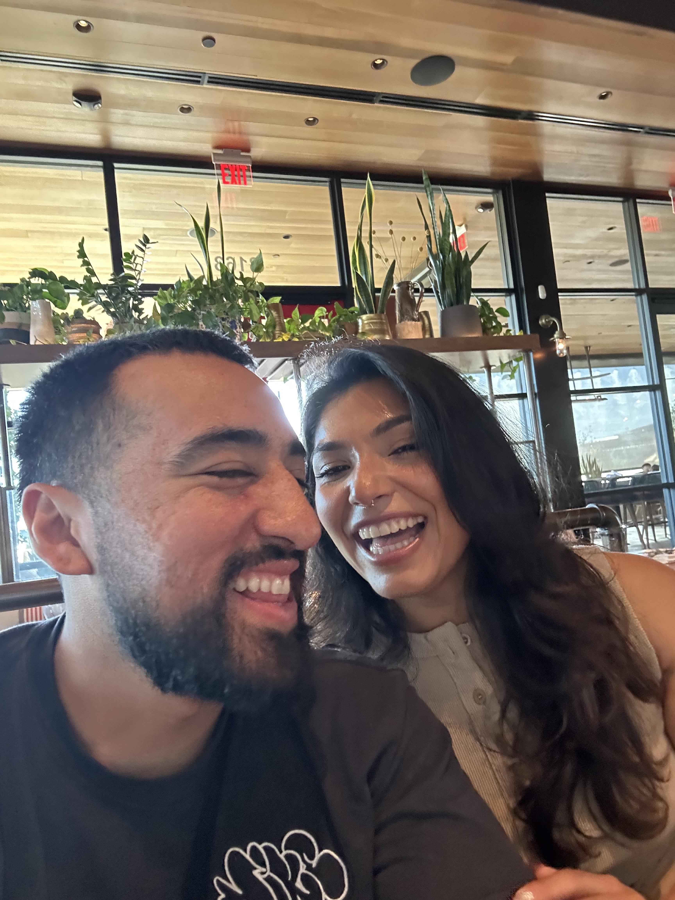
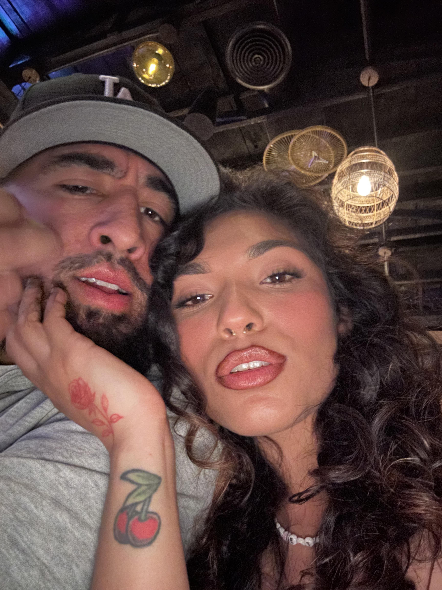

# index.html
<!doctype html>
<html lang="en">
<head>
  <meta charset="utf-8" />
  <meta name="viewport" content="width=device-width,initial-scale=1" />
  <title>Jeanette & Alonso — Love Portfolio</title>
  <link rel="preconnect" href="https://fonts.gstatic.com" crossorigin>
  <link href="https://fonts.googleapis.com/css2?family=Inter:wght@300;400;600;800&family=Playfair+Display:wght@400;700&display=swap" rel="stylesheet">
  
</head>
<body>
  <header>
    

      
J&A

      

        
Jeanette & Alonso

        <small style="color:var(--muted)">Adventures • Love • Life</small>
      

    

    <nav>
      <a href="#about">About</a>
      <a href="#gallery">Gallery</a>
      <a href="#music">Music</a>
    </nav>
  </header>

  <main>
    <section class="hero" aria-labelledby="hero-heading">
      

        <h1 id="hero-heading">Two hummingbirds, one story</h1>
        
Welcome to our little corner of the internet  a colorful, minimal tribute to the moments that shaped us. Save this page, add the music, and come back whenever you need a reminder of how far we've come.

        

          <button class="btn btn-primary" onclick="document.getElementById('about').scrollIntoView({behavior:'smooth'})">Our Story</button>
          <button class="btn btn-ghost" onclick="document.getElementById('music').scrollIntoView({behavior:'smooth'})">Play Music</button>
        

        
Tip: On mobile, tap the music control to start playback (autoplay may be blocked by some browsers).

      

      <aside class="portrait" aria-label="Jeanette and Alonso portrait">
        <!-- Mobile-ready hero image -->
        
        

          Jeanette
          Alonso
        

      </aside>
    </section>

    <section id="about" class="sections" aria-labelledby="about-heading">
      

        <h3 id="about-heading">Adventures</h3>
        
From sunrise hikes to midnight drives — we collect memories. This section holds snapshots and short notes about the places we've been and the ones we dream of.

      

      

        <h3>Love</h3>
        
Small gestures, big meaning. Love here is a practice — patience, laughter, shared playlists, and the rituals that make us us.

      

      

        <h3>Life</h3>
        
Everyday life — routines and surprises. This is the glue: home projects, cooking experiments, and growing together.

      

    </section>

    <section id="gallery" class="gallery" aria-label="Gallery">
      
      
      
    </section>

    <section id="music" class="music" aria-labelledby="music-heading">
      

        <h3 id="music-heading">Our Song</h3>
        
Tap play to hear the song — replace with your own audio if needed.

      

      

        <audio id="player" controls loop>
          <source src="song.mp3" type="audio/mpeg">
          Your browser does not support the audio element.
        </audio>
      

    </section>
  </main>

  <footer>
    
Built with ♥

    
Made for Jeanette & Alonso — replace images & text freely

  </footer>

  
❤

  
</body>
</html>
